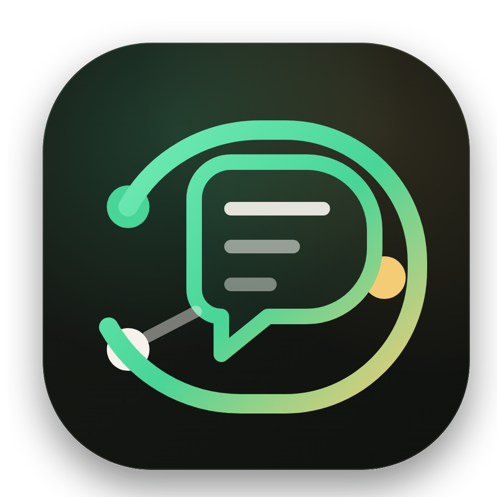
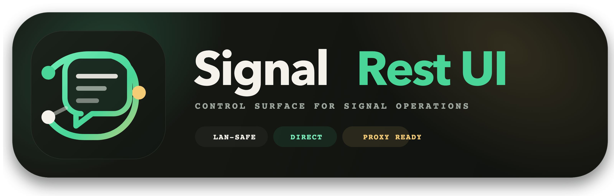

# Signal Rest UI

<p align="center">
  
</p>

<p align="center">
  
</p>

Signal Rest UI is a React-based control surface for [`signal-cli-rest-api`](https://github.com/bbernhard/signal-cli-rest-api). It wraps the endpoints operators use most often in a focused browser UI, while still exposing a searchable API console for everything else in the bundled Swagger spec.

The app is built for LAN-style deployments: you can talk to the upstream API directly from the browser when CORS and routing allow it, or route requests through the included Hono server when they do not.

## What You Can Do

- Save multiple Signal API connection profiles in the browser.
- Test connectivity against `/v1/about` before saving a profile.
- Switch between direct browser access and same-container proxy transport.
- Register numbers, verify numbers, and link devices with a QR flow.
- Send messages with attachments through `/v2/send`.
- Manually receive messages and inspect raw payloads.
- Browse and edit contacts.
- Create, update, and manage groups.
- Preview and delete downloaded attachments.
- Search and execute endpoints from the vendored Swagger catalog.

## Quick Start

### Local Development

```bash
pnpm install
pnpm dev
```

That starts the Vite dev server on `http://localhost:5173`.

### Production Build

```bash
pnpm build
pnpm preview
```

`pnpm preview` serves the built client and `/config.json` through the bundled Hono server on port `3000` by default.

## Docker Compose

The default container workflow is:

```bash
docker compose up --build
```

That builds the image from the local `Dockerfile` and serves the app at `http://localhost:3000`.

The compose file reads optional overrides from your shell or a local `.env` file. The most useful ones are:

```dotenv
SIGNAL_REST_UI_PORT=3000
PROXY_ENABLED=true
PROXY_ALLOWED_HOSTS=192.168.1.20,signal.local,host.docker.internal
DEFAULT_TRANSPORT=proxy
```

Stop the stack with:

```bash
docker compose down
```

## Docker

If you prefer running the image directly, build it with:

```bash
docker build -t signal-rest-ui .
```

Then run it with:

```bash
docker run --rm \
  -p 3000:3000 \
  -e PROXY_ENABLED=true \
  -e PROXY_ALLOWED_HOSTS=192.168.1.20,signal.local \
  signal-rest-ui
```

Then open `http://localhost:3000`.

## Runtime Configuration

The server exposes runtime settings at `/config.json`. The client reads that file on startup and merges it with safe fallbacks.

### Supported Environment Variables

| Variable                | Default                                          | Purpose                                                     |
| ----------------------- | ------------------------------------------------ | ----------------------------------------------------------- |
| `PORT`                  | `3000`                                           | Port for the Hono server.                                   |
| `APP_BRANDING_NAME`     | `Signal Rest UI`                                 | Sidebar/app name.                                           |
| `APP_BRANDING_TAGLINE`  | `Modern control surface for signal-cli-rest-api` | Hero/tagline text.                                          |
| `DEFAULT_TRANSPORT`     | `direct`                                         | Initial transport for new profiles: `direct` or `proxy`.    |
| `DEFAULT_PROFILES_JSON` | `[]`                                             | JSON array of preloaded connection profiles.                |
| `PROXY_ENABLED`         | `false`                                          | Enables the server-side `/proxy/*` transport.               |
| `PROXY_BASE_PATH`       | `/proxy`                                         | Proxy mount path exposed by the server.                     |
| `PROXY_ALLOWED_HOSTS`   | empty                                            | Comma-separated allowlist for proxy targets.                |
| `REFRESH_INTERVAL_MS`   | `15000`                                          | Client refresh interval hint used by app state and queries. |

When using `compose.yaml`, you can set these values through a local `.env` file or exported shell variables before running `docker compose up`.

### Example `DEFAULT_PROFILES_JSON`

```json
[
  {
    "id": "home-node",
    "label": "Home Signal Node",
    "baseUrl": "http://192.168.1.20:8080",
    "transport": "proxy",
    "authHeaderName": "Authorization",
    "authToken": "Bearer change-me",
    "defaultAccountNumber": "+49123456789",
    "autoReceiveEnabled": false,
    "createdAt": "2026-01-01T00:00:00.000Z",
    "updatedAt": "2026-01-01T00:00:00.000Z"
  }
]
```

## How Transport Works

- `direct`: the browser talks to the upstream Signal API directly.
- `proxy`: the browser sends requests to this app's `/proxy/*` endpoint, and the Hono server forwards them.

Use `direct` when the browser can already reach the upstream API cleanly. Use `proxy` when browser CORS rules or local network visibility block direct access.

The proxy is intentionally restricted. A target host must be explicitly allowed through `PROXY_ALLOWED_HOSTS`, and the client sends the target base URL in the `x-target-base-url` header.

When the UI itself runs in Docker, the upstream Signal API host must also be reachable from the container. If your API runs on the Docker host, `host.docker.internal` is often the right hostname on Docker Desktop.

## Screens

- `Overview`: connection telemetry, counts, and operator guidance.
- `Connect`: create/test/save profiles and switch active targets.
- `Accounts`: list accounts, link devices, register numbers, verify numbers.
- `Messages`: send messages, attach files, and manually pull messages.
- `Contacts`: search, edit, and sync contact data.
- `Groups`: create groups and manage membership/admin settings.
- `Attachments`: browse, preview, and delete downloaded files.
- `API Console`: search the vendored Swagger spec and execute uncommon requests.

## Important Behavior

- Profiles are stored in browser `localStorage` under `signal-rest-ui/state`.
- Any auth token entered in a saved profile is therefore stored in that browser profile as well.
- Auto-receive is intentionally not scheduled by the UI. The app keeps it as an explicit profile preference and exposes manual receive on the Messages screen.
- The server is stateless apart from normal container filesystem contents. User state lives in the browser unless you seed `DEFAULT_PROFILES_JSON`.

## Development

### Scripts

```bash
pnpm dev
pnpm build
pnpm preview
pnpm test
pnpm test:watch
pnpm test:e2e
pnpm lint
pnpm format
pnpm prepare:openapi
pnpm generate:api
```

Container workflow:

```bash
docker compose up --build
docker compose down
```

## Releases

Releases are automated with `release-please` on GitHub Actions.

- Merge Conventional Commit changes into `main`.
- `release-please` opens or updates a release PR that bumps `package.json` and `CHANGELOG.md`.
- Merging that release PR creates the GitHub Release and pushes the official GHCR image.

### Commit and PR Title Format

Use Conventional Commits for anything that lands on `main`. This matters most when squash merging, because the PR title usually becomes the final commit message.

Common examples:

```text
feat: add QR refresh action
fix: handle proxy connection failures
docs: clarify docker compose setup
refactor!: change profile persistence format
```

Release impact:

- `fix:` -> patch release
- `feat:` -> minor release
- `type!:` or `BREAKING CHANGE:` -> major release

### Published Container Images

Official release images are published to GitHub Container Registry:

- `ghcr.io/mrragga-/signal-rest-ui:vX.Y.Z`
- `ghcr.io/mrragga-/signal-rest-ui:latest`

Pull an official release with:

```bash
docker pull ghcr.io/mrragga-/signal-rest-ui:latest
```

### API Code Generation

The vendored Swagger source lives at `docs/swagger.json`.

When the upstream API surface changes:

```bash
pnpm prepare:openapi
pnpm generate:api
```

That pipeline:

1. Converts Swagger 2.0 into OpenAPI at `docs/swagger.openapi.json`.
2. Regenerates the Orval client into `src/lib/api/generated/`.

## Testing

- Unit and route tests use Vitest, Testing Library, and MSW.
- End-to-end coverage uses Playwright.
- The current Playwright flow exercises connect -> select account -> send message against mocked upstream routes.

Run the main verification set with:

```bash
pnpm test
pnpm lint
pnpm format
```

Run browser coverage with:

```bash
pnpm test:e2e
```
